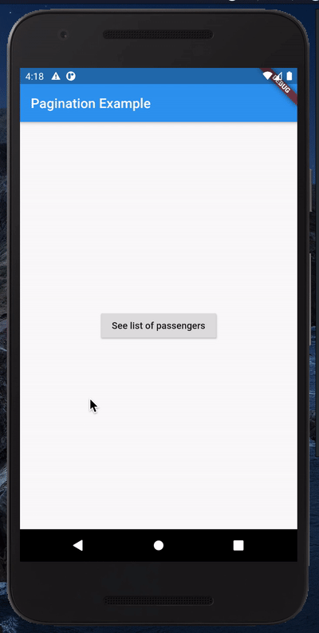

# paginated_consumer

[](https://pub.dev/packages/paginated_consumer)

paginated_consumer is a flutter package that allows you to enable easy pagination if you already have a project that is based on provider state management. 

This package combines the provider package and pull_to_refresh package to provide the seamless integration of the Pagination.





## Installation

Use flutter pub to install **paginated_consumer**.

```dart
paginated_consumer : 0.0.2
```

## Usage
#### Step 1 : Extend PaginatedProvider
 Extend the existing provider model with PaginatedProvider 


```dart
import 'package:paginated_consumer/pagination_provider.dart';

class CarModelProvider extends PaginationProvider<CarModel> {
```
#### Step 2 : Override fetchByPage method
Override the method fetchByPage with exact parameters. This method should return the list of same type that was provided in the PaginationProvider generic type.

```dart
import 'package:paginated_consumer/pagination_provider.dart';

class CarModelProvider extends PaginationProvider<CarModel> {

  @override
  Future<List<CarModel>> fetchByPage(
          {int page, int pageSize}) async {
  //     ... call your api here and return list of CarModel
  }
}
```
This method will be called each time when you try to refresh and load more in the screen

#### Step 3 : Replace Consumer by PaginatedConsumer widget
Replace the Consumer widget available in provider package by PaginatedConsumer of this package

```dart

import 'package:paginated_consumer/paginated_consumer.dart';

PaginatedConsumer<CarModelProvider>(
    builder: (BuildContext context, CarModelProvider provider) {
    return ListView.builder(
        itemCount: provider.dataList.length,
        itemBuilder: (context, index) => CarWidget(
        car : provider.dataList[index],
        ),
    );
    },
),
 

```
Notice the 'dataList' object. This is the list of paginated data of type that was provided while extending the PaginatedProvider or the type of the list returned by overridden fetchByPage method


#### Now the list view screen is ready for pull down and pull ups for refresh and load more data respectively.

## Contributing
Pull requests are welcome. For major changes, please you can create an issue to discuss what you would like to change.

## License
[MIT](https://github.com/subeg7/Paginated-Consumer/blob/master/LICENSE)
**Free Software, Hell Yeah!**
